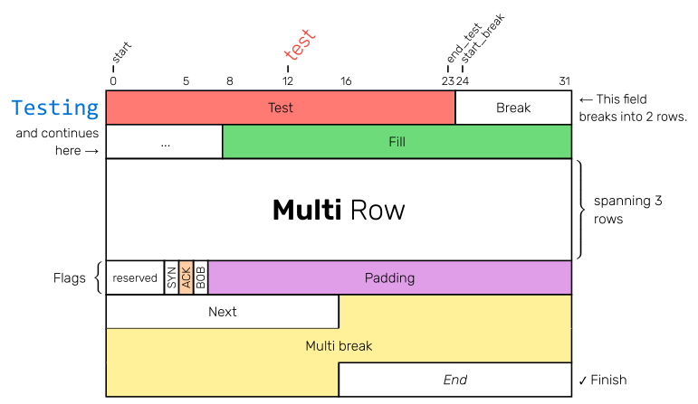

# typst-bytefield 

A simple way to create network protocol headers, memory maps, register definitions and more in typst.

Using [tablex](https://github.com/PgBiel/typst-tablex) under the hood.

⚠️ Warning. As this package is still in an early stage, things might break with the next version.

ℹ️ If you find a bug or a feature which is missing, please open an issue and/or send an PR.

## Example



```typst
#import "@preview/bytefield:0.0.4": *

#bytefield(
// Config the header
bitheader(
"bytes",
// adds every multiple of 8 to the header.
0, [start], // number with label
5,
// number without label
12, [#text(14pt, fill: red, "test")],
23, [end_test],
24, [start_break],
36, [Fix], // will not be shown
marker: auto, // auto or none (default: auto)
angle: -50deg, // angle (default: -60deg)
text-size: 8pt, // length (default: global header_font_size or 9pt)
),
// Add data fields (bit, bits, byte, bytes) and notes
// A note always aligns on the same row as the start of the next data field.
note(left)[#text(16pt, fill: blue, font: "Consolas", "Testing")],
bytes(3,fill: red.lighten(30%))[Test],
note(right)[#set text(9pt); #sym.arrow.l This field \ breaks into 2 rows.],
bytes(2)[Break],
note(left)[#set text(9pt); and continues \ here #sym.arrow],
bits(24,fill: green.lighten(30%))[Fill],
group(right,3)[spanning 3 rows],
bytes(12)[#set text(20pt); *Multi* Row],
note(left, bracket: true)[Flags],
bits(4)[#text(8pt)[reserved]],
flag[#text(8pt)[SYN]],
flag(fill: orange.lighten(60%))[#text(8pt)[ACK]],
flag[#text(8pt)[BOB]],
bits(25, fill: purple.lighten(60%))[Padding],
// padding(fill: purple.lighten(40%))[Padding],
bytes(2)[Next],
bytes(8, fill: yellow.lighten(60%))[Multi break],
note(right)[#emoji.checkmark Finish],
bytes(2)[_End_],
)
```


## Usage

To use this library through the Typst package manager import bytefield with `#import "@preview/bytefield:0.0.4": *` at the top of your file.

The package contains some of the most common network protocol headers which are available under: `common.ipv4`, `common.ipv6`, `common.icmp`, `common.icmpv6`, `common.dns`, `common.tcp`, `common.udp`.

## Features

Here is a unsorted list of features which is possible right now.

- Adding fields with `bit`, `bits`, `byte` or `bytes` function.
  - Fields can be colored
  - Multirow and breaking fields are supported.
- Adding notes to the left or right with `note` or `group` function.
- Config the header with the `bitheader` function. !Only one header per bytefield is processed currently.
  - Show numbers
  - Show numbers and labels
  - Show only labels
- Change the bit order in the header with `msb:left` or `msb:right` (default)


See [example.typ](example.typ) for more information.

# Changelog

See [CHANGELOG.md](CHANGELOG.md)
